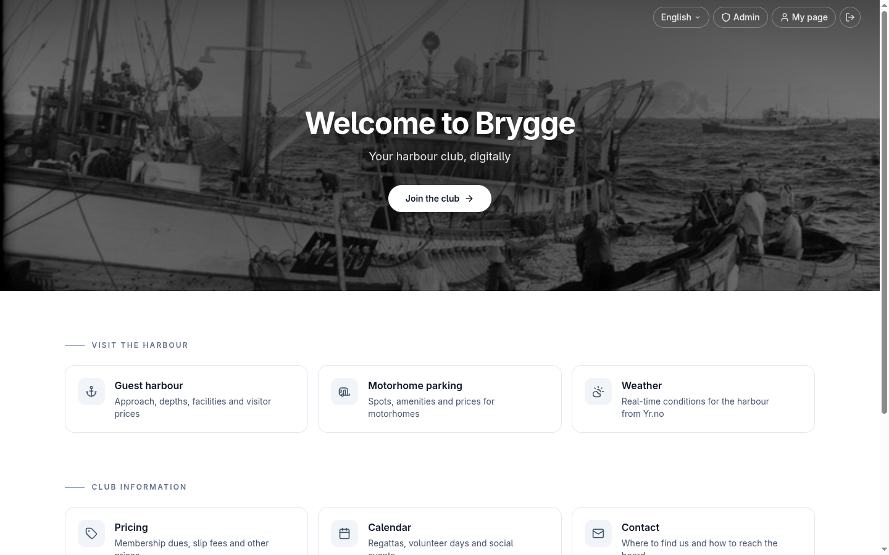
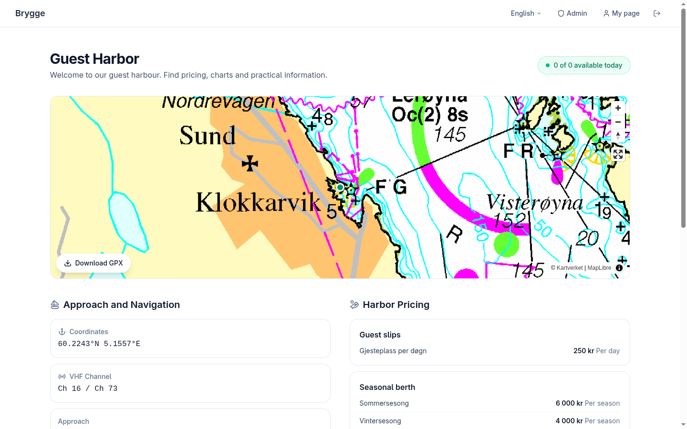
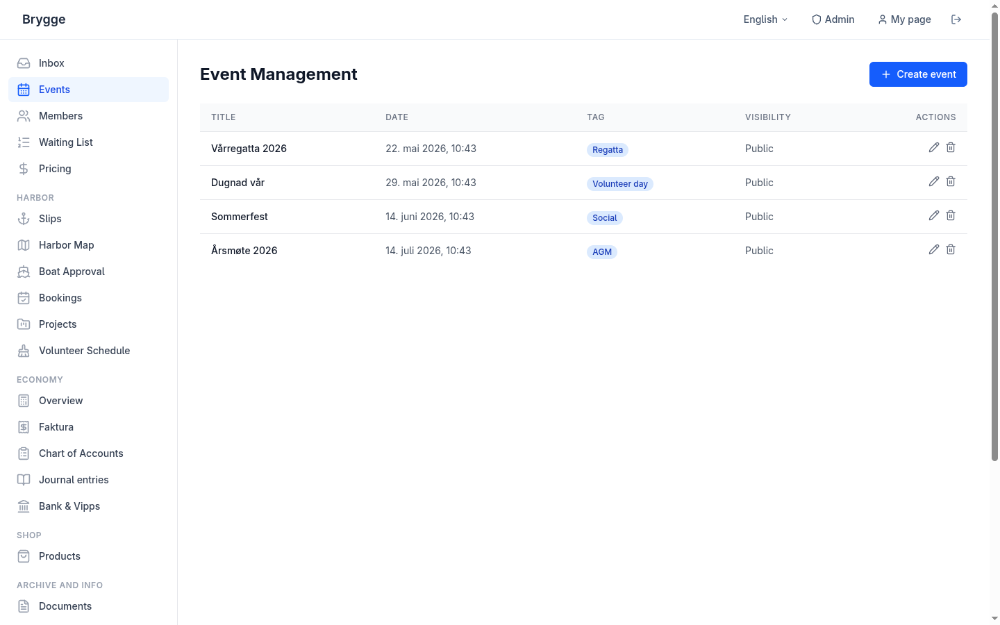
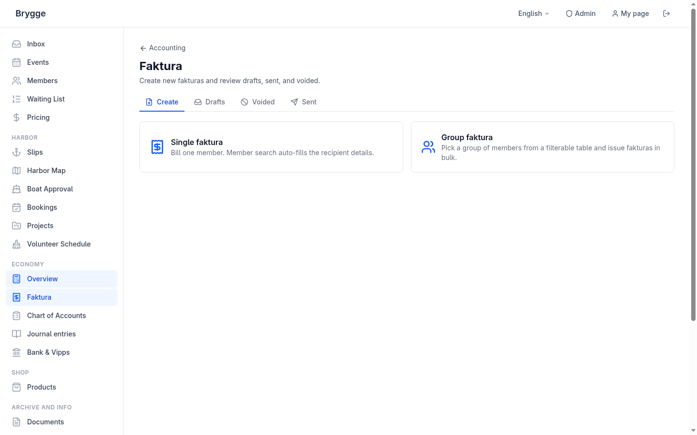
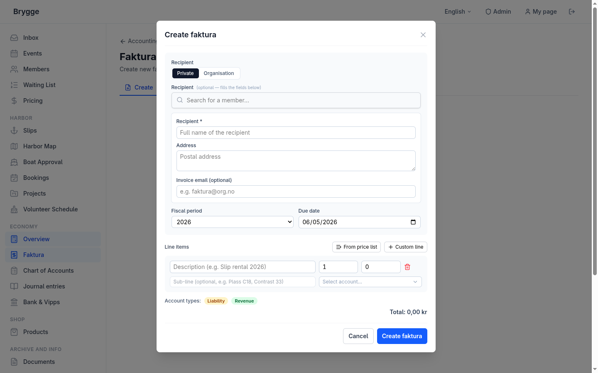
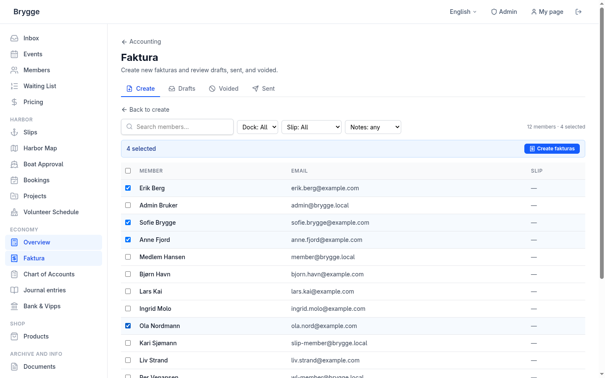

  

<h1 align="center">Brygge</h1>

  Self-hosted management software for harbour clubs, boat associations, and small marinas.

  

---

Brygge runs the back office of a boat club — the membership roll and waiting list, slip assignments, invoicing, bookings, volunteer days, the harbour map, and the calendar.

It replaces the spreadsheets, the shared mailbox, and the manual bank reconciliation that volunteer boards juggle every season.

## Why Brygge

| Goal | What it means |
| --- | --- |
| **Low running cost** | The whole platform — app, database, mail — runs on one small VPS, about the price of a coffee a month. No per-member fees, no SaaS subscription. |
| **Fully integrated** | Membership, billing, payments, and mail are one system. An invoice knows who it's for, a bank payment reconciles itself against it, and role mailboxes follow whoever holds the role. |
| **Built for volunteers** | Board members aren't operators. Sending an invoice, approving a slip, posting a notice — meant to be obvious without training. |
| **Clubs, not islands** | A shared directory of boats and clubs cuts data entry, and nearby harbours can discover each other's free guest berths and coordinate visiting boats. |

One Go binary with an embedded web app, backed by PostgreSQL and Redis. Every feature is behind a flag, so a club runs only what it needs.

## What it does

- **Members & slips** — member roll, boat register, slip assignments, waiting list, GDPR export and deletion.
- **Billing** — Norwegian faktura with KID, bulk invoicing, automatic bank and Vipps reconciliation, accounting reports.
- **Payments** — Vipps for dues and bookings, overdue tracking.
- **Bookings** — guest slips, motorhome/RV spots, the club room, and the hoist; member slip rental; a waiting list that offers and expires places automatically.
- **Mail** — a self-hosted mail server; role mailboxes (treasurer, harbour master, …) are readable from the admin portal by whoever holds the role.
- **Communications** — member broadcasts and web push notifications.
- **Operations** — volunteer-day tracking, an interactive harbour map, and a club calendar.

### What each styre role gets

| Role | Day-to-day in Brygge |
| --- | --- |
| **Leder** (chair) | Whole-club overview, member broadcasts, events and the calendar. |
| **Kasserer** (treasurer) | Bulk faktura with KID, automatic bank/Vipps reconciliation, accounting reports. |
| **Havnesjef** (harbour master) | Slip assignments, the waiting list, bookings, and the harbour map. |
| **Sekretær** (secretary) | Shared role mailbox, document archive, meeting and event records. |
| **Dugnadsansvarlig** (volunteer coordinator) | Volunteer-day sign-up and attendance tracking. |

## Screenshots

**Public — what members and visitors see**

  

  

**Admin — running the club**

  

**Invoicing — single and bulk faktura**

  

  

  

## Documentation

### For club operators

| Guide | What it covers |
| --- | --- |
| [Invoicing](docs/user/faktura.md) | Creating and sending faktura, KID payment matching, reconciliation |

### For developers

| Topic | What it covers |
| --- | --- |
| [Quickstart](docs/developer/quickstart.md) | Run the full stack locally |
| [Deployment](docs/developer/deploy.md) | Provision and deploy to a VPS — server setup, configuration, database operations |
| [Architecture](docs/architecture.md) | System design and the technology stack |
| [Mail server](docs/developer/mail/setup.md) | Self-hosted Stalwart and the shared inbox |
| [Operations](docs/developer/troubleshooting.md) | Troubleshooting, SSH recovery, and observability |
| [Security](docs/developer/security/2fa.md) | Two-factor authentication |
| [Contributing](CONTRIBUTING.md) | Development workflow and how to help |

## Contributing

Help is welcome — translations, bug reports, fixes, or whole new modules. Clubs have specific needs, and the project improves as more of them are represented in the code. If you run Brygge for your own club, sharing what you changed is the most useful contribution of all. See the contributing guide above for the development workflow.

## Status

Alpha. Brygge runs in production at a live club but is under active development; interfaces and data shapes can still change between releases. Bug reports and input are encouraged.
