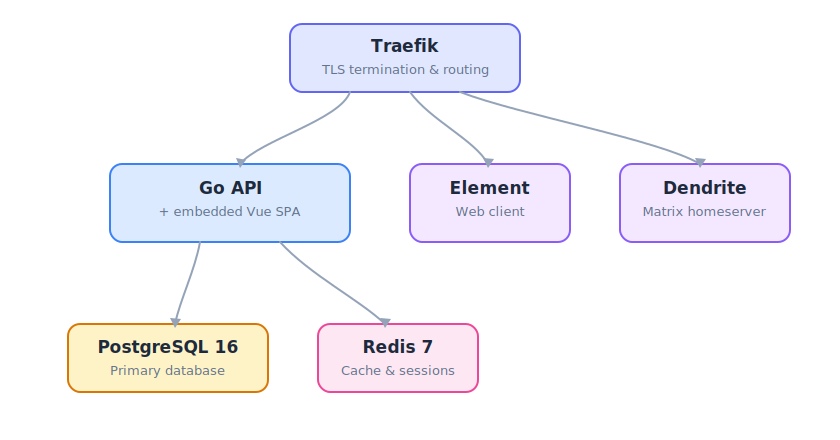

# Architecture

<p align="center">
  
</p>

Brygge is a monorepo. The Go binary embeds the Vue production build via `go:embed` and serves both the API (`/api/v1/*`) and the SPA from a single process. For Kubernetes-style deployments where you'd rather run them separately, build with the `noembed` tag and serve the frontend from any static host — see [developer/k8s.md](developer/k8s.md).

## Request flow

```
View / Composable
    → useApiClient() → openapi-fetch (typed)
        → TanStack Query cache
            → /api/v1/... handler
                → PostgreSQL / Redis
```

Paginated endpoints return `{ items, limit, offset, has_more }`. Composables strip the envelope before returning to views, so call sites work with arrays.

## Modules

Brygge is organised around feature modules, each gated by a flag in `deploy/.env`:

| Module           | What it covers                                                                       |
|------------------|--------------------------------------------------------------------------------------|
| Member portal    | Profile, boats, slips, waiting list, document archive, directory, GDPR export/delete |
| Bookings         | Guest slips, motorhome spots, club rooms, hoist scheduling                           |
| Accounting       | Invoices (faktura), KID/OCR, dues, electricity, member-tiered pricing                |
| Commerce         | Vipps payments, merchandise shop, overdue tracking                                   |
| Communications   | Broadcast email, web push, integrated forum (Matrix)                                 |
| Projects         | Dugnad (working day) tracking, kanban boards, shopping lists                         |
| Calendar         | Events, iCal export, RSVP, regattas                                                  |
| Admin            | RBAC (7 roles), audit log, slips, waiting list, feature flags                        |

Turning a flag off removes both the routes and the navigation entries — no dead links.

## Deployment shape

A single VPS runs the Brygge image, Postgres, Redis, Traefik, Stalwart (mail), and optionally Dendrite for the forum. Backups live on S3-compatible object storage. The standard target is a Hetzner CAX11 — see [developer/deploy.md](developer/deploy.md) for the full walkthrough.
